# The World of Software Testing

---

### 🤔 ทำไมต้องเขียนเทส ?

> เสียเวลา - เอาเวลาไปเขียนโค้ดเลยไม่ดีกว่าเหรอ? จะเปลี่ยนทำไม - ทุกวันนี้ก็ดีแล้วอยู่แล้วนิ? งานเร่ง - วันหยุดก็แทบไม่ได้พักแล้วยังจะเพิ่มงานอีกเหรอ? บลาๆ  
━ เสียงเดฟแอบกล่าวในใจ ━
<!-- .element: style="width:80%;font-size:1.3rem" -->

---

### โลกของซอฟต์แวร์
### ← - - ในมุมมองที่กว้างขึ้น - - → <!-- .element: class="small animate__jackInTheBox" style="color:#ffb02e" -->

---

<!-- .slide: data-auto-animate data-auto-animate-id="intro" -->
### ปัญหาบริษัทซอฟต์แวร์

การอยู่รอดของบริษัทขึ้นกับการจัดการของเพียง 4 อย่าง

 <!-- .element: style="margin-top:0px;" -->

1. รับงานใหม่
1. จัดการงานเก่า
1. จัดการทีม
1. บริหารสภาพคล่อง

---

<!-- .slide: data-auto-animate data-auto-animate-id="intro" -->
### ปัญหาบริษัทซอฟต์แวร์

บริษัท ━ ไม่สามารถรับงานใหม่ได้ แม้ว่าอยากจะรับแค่ไหนก็ตาม 🤨
<!-- .element: style="font-size:2rem" -->

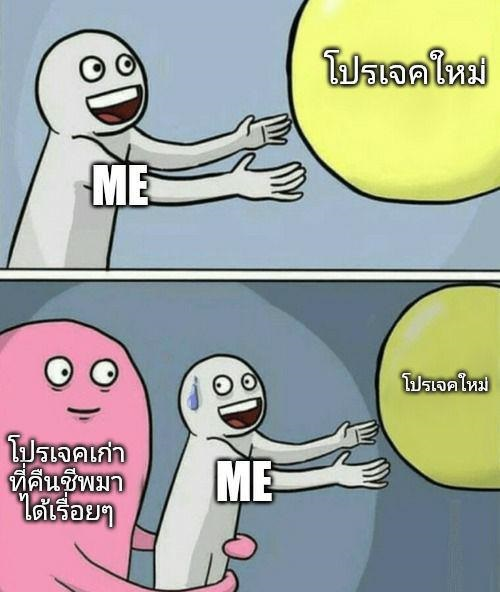 <!-- .element: style="margin-top:0px;" -->

1. ~~รับงานใหม่~~
1. จัดการงานเก่า
1. จัดการทีม
1. บริหารสภาพคล่อง

---

<!-- .slide: data-auto-animate data-auto-animate-id="intro" -->
### ปัญหาบริษัทซอฟต์แวร์

เดฟ ━ ไม่กล้าแก้โค้ดเดิม เพราะกลัวว่าของที่ใช้งานได้จะพัง 😣
<!-- .element: style="font-size:2rem" -->

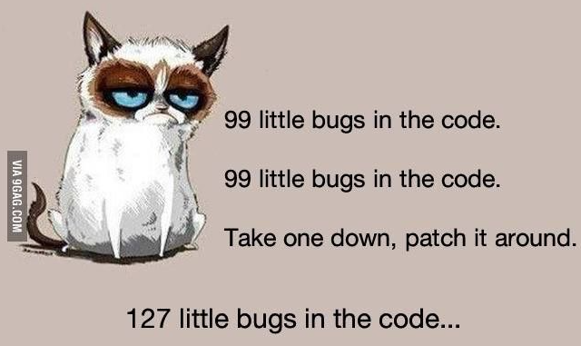 <!-- .element: style="margin-top:0px;" -->

1. ~~รับงานใหม่~~
1. ~~จัดการงานเก่า~~
1. จัดการทีม
1. บริหารสภาพคล่อง

---

<!-- .slide: data-auto-animate data-auto-animate-id="intro" -->
### ปัญหาบริษัทซอฟต์แวร์

เดฟ & Biz ━ เข้าใจประเด็นแตกต่างกัน ทำให้งานไปกันคนละทิศ 😫
<!-- .element: style="font-size:2rem" -->

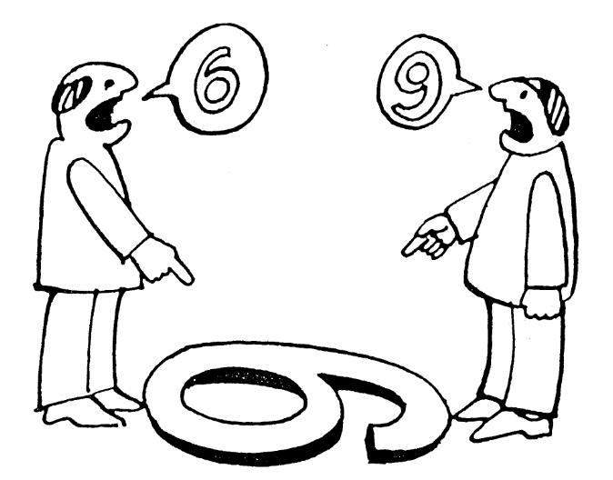 <!-- .element: style="margin-top:0px;" -->

1. ~~รับงานใหม่~~
1. ~~จัดการงานเก่า~~
1. ~~จัดการทีม~~
1. บริหารสภาพคล่อง

---

### ปัญหาของบริษัทซอฟต์แวร์
### **ไม่ใช่การทำซอฟต์แวร์** 🤨

`รับงานใหม่` — `จัดการงานเก่า` — `จัดการทีม` — `บริหารสภาพคล่อง`

<!-- .element: class="small animate__bounceInDown" style="font-size:1.8rem;" -->

---

<!-- .slide: data-auto-animate data-auto-animate-id="intro" -->
### ปัญหาบริษัทซอฟต์แวร์

สาเหตุหลักที่ทำให้บริษัทซอฟต์แวร์ตายไม่ได้เกิดจาก Technical skills แต่กลับเป็น Non-technical skills ต่างหาก (การบริหารจัดการโปรเจค ทัศนคติ การทำงานเป็นทีม)
<!-- .element: style="width:90%;font-size:1.6rem" -->

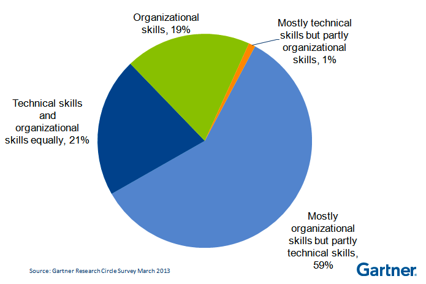

---

<!-- .slide: data-auto-animate data-auto-animate-id="intro" -->
### ปัญหาบริษัทซอฟต์แวร์

[**Brooks's Law**](https://en.wikipedia.org/wiki/Brooks%27s_law) ━ เมื่อถึงจุดหนึ่งยิ่งเพิ่มคนจะยิ่งทำให้งานช้าลงเรื่อยๆ
<!-- .element: style="font-size:1.7rem" -->

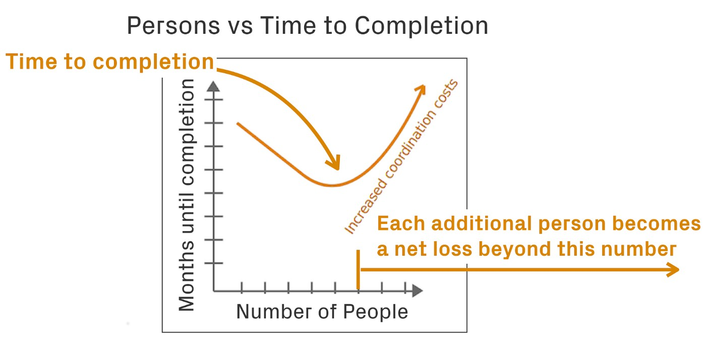

---

<!-- .slide: data-auto-animate data-auto-animate-id="intro" -->
### ปัญหาบริษัทซอฟต์แวร์

**Maintenance** ━ คือค่าใช้จ่ายหลักในการทำซอฟต์แวร์โปรเจค
<!-- .element: style="font-size:1.6rem" -->

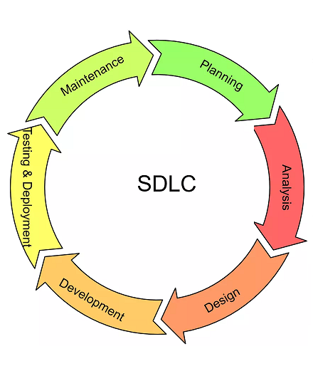
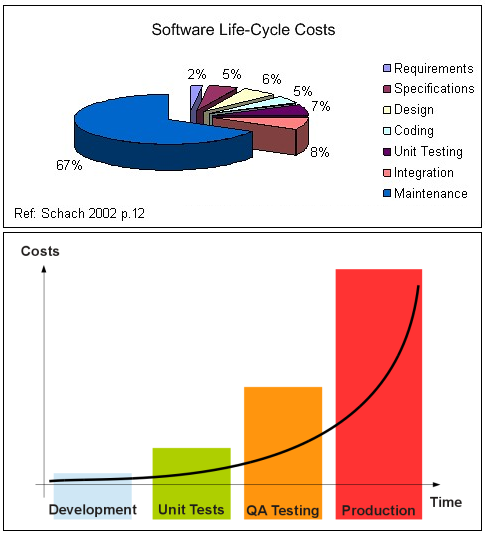

---

<!-- .slide: data-auto-animate data-auto-animate-id="intro" -->
## Maintenance Challenges

> หลากหลายเจ้าของ - พี่ส้มที่เขียนไว้เขาลาออกไปแล้ว, การรักษาคุณภาพของโค้ด - เดี๋ยวค่อยกลับมาแก้ละกัน, Legacy code - คงมีแต่พระเจ้าที่เข้าใจโค้ดนี้แล้วซินะ, Domain expertise - การคำนวณทางบัญชีใช้สูตรไรนะ, Verification & Validation - ทำตามลูกค้าพูดแล้วนะแต่ทำไมยังไม่ถูก, Requirement change - อ้าวไม่ได้ออกแบบให้ทำเรื่องพวกนี้ได้นะ
<!-- .element: style="width:80%;font-size:1.3rem" -->

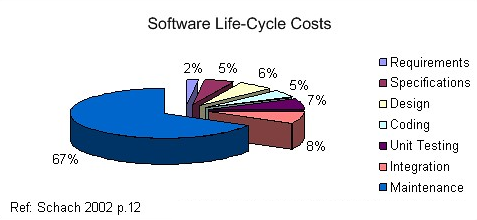
<!-- .element: style="margin-bottom:0px" -->

⬆️ Maintenance cost → การรับงานใหม่ + จัดการงานเก่า + ความรู้สึกของคนในทีม
<!-- .element: style="margin-top:0px;font-size:1.8rem" -->

---

<!-- .slide: data-auto-animate data-auto-animate-id="intro" -->
### ปัญหาบริษัทซอฟต์แวร์

[**Technical Debt**](https://en.wikipedia.org/wiki/Technical_debt) ━ เดฟไม่ชอบโปรเจคที่ทำอยู่เพราะมีปัญหาเยอะ รอเวลาขึ้นโปรเจคใหม่เพราะทุกอย่างใหม่และเร็ว แต่ผ่านไปซักพักก็เป็นปัญหาเหมือนโปรเจคเดิม วนเป็นวัฏจักร
<!-- .element: style="font-size:1.7rem" -->

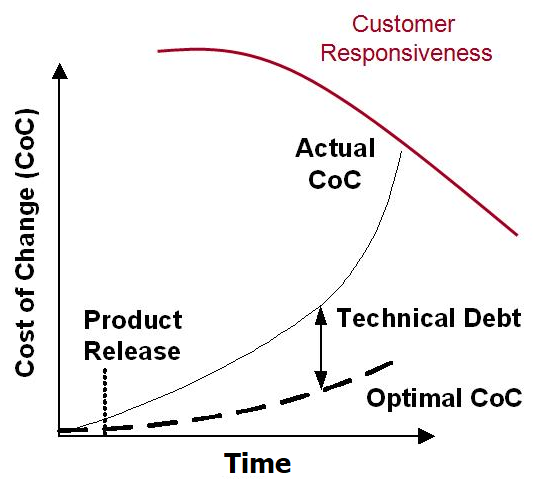 <!-- .element: style="margin-top:0px;" -->
The performance paradox

ยิ่งปล่อยเวลาผ่านไป

* ยิ่งทำยิ่งแย่ลง
* ค่าใช้จ่ายยิ่งสูงขึ้น
* ตัวเลือกยิ่งน้อยลง
* ความน่าเชื่อถือยิ่งลดลง
* ประเมินเวลาทำงานไม่ได้
4. ~~บริหารสภาพคล่อง~~

---

<!-- .slide: data-auto-animate data-auto-animate-id="intro" -->
## 🤕 คนร้ายที่ก่อเหตุคือใคร ?

---

<!-- .slide: data-auto-animate data-auto-animate-id="intro" -->

<!-- .element: style="margin-bottom:0px" -->
`Developers`

---

<!-- .slide: data-auto-animate data-auto-animate-id="intro" -->
### 🤨 เดฟไม่รู้เหรอว่ามีปัญหาพวกนี้ ?

> รู้นานแล้ว - แต่ไม่รู้จะแก้ไงดี, แก้ไม่ได้หรอก - แก้ไปแล้วระบบมีปัญหาใครจะรับผิดชอบ?, เคยลองแล้ว - สุดท้ายกลับมาเป็นเหมือนเก่า, โค้ดพี่ส้ม - อ่านแล้วไม่เข้าใจ แต่รู้ว่าแก้แล้วพังตลอดเลยปล่อยไว้งี้ บลาๆ  
━ เสียงเดฟแอบกล่าวในใจ ━
<!-- .element: style="width:90%;font-size:1.3rem" -->

งานซอฟต์แวร์เป็นงานแฮนเมดเลยวัดความถูกต้องได้ยาก
<!-- .element: class="fragment" -->

---

<!-- .slide: data-auto-animate data-auto-animate-id="intro" -->
### 🤨 งานซอฟต์แวร์วัดความถูกต้องยาก ?

> TOR - เขียนงานตามนั้นเด๊ะๆแล้วมันใช้งานได้จริงป่ะ?, คู่มือการใช้งาน - โค้ดที่รันกับที่เขียนในคู่มือมันยังเหมือนกันอยู่ป่าว?, ทีมเทส - เทสได้เฉพาะเท่าที่เห็นเท่านั้น แล้วของที่ไม่เห็นล่ะ?, ความถี่ในการเทส - เทสเช้าจรดเย็นยังไม่พออีกเหรอ? ห๊ะ! จะขอเทสตอนตี 3 ในวันเสาร์อาทิตย์ด้วย  
━ เสียงเดฟแอบกล่าวในใจ ━
<!-- .element: style="width:90%;font-size:1.3rem" -->

ก็พอได้อยู่นะแต่ไม่สามารถเอามาใช้ในทางปฎิบัติได้จริง
<!-- .element: class="fragment" -->

---

<!-- .slide: data-auto-animate data-auto-animate-id="intro" -->
### 💖 ปัญหาบริษัทซอฟต์แวร์

รับงานใหม่ไม่ได้ — จัดการงานเก่าไม่ได้ — จัดการทีมไม่ได้ — จัดการสภาพคล่องยาก
<!-- .element: style="font-size:1.7rem" -->

`#ไม่กล้าแก้โค้ดเดิม` `#เข้าใจไม่ตรงกัน` `#การบริหารจัดการโปรเจค` `#ทัศนคติ` `#การทำงานเป็นทีม` `#การเพิ่มคนเข้าทีม` `#MaintenanceCost` `#TechnicalDebt` `#ยิ่งทำยิ่งแย่ลง` `#ค่าใช้จ่ายสูงขึ้นเรื่อยๆ` `#ค่าน่าเชื่อถือตก` `#TechnicalSkills` `#NonTechnicalSkills` `#รู้ว่ามีปัญหาแต่แก้ไม่ได้` `#วัดความถูกต้องได้ยาก` `#เดฟคือคนร้ายเสียเอง😭`

---

<!-- .slide: data-auto-animate data-auto-animate-id="intro" -->
### 🤔 แล้วจะแก้ยังไง ?
# Why Why Analysis <!-- .element: style="color:#ffb02e" -->

`โปรเจคล่าช้า` → `เพิ่มความสามารถใหม่ยาก` → `โปรเจคมีความซับซ้อนสูง` → `Technical Debt`
<!-- .element: class="small animate__jackInTheBox" style="color:#ffb02e" -->

→ `เดี๋ยวมีเวลาค่อยกลับมาทำ` → `เดฟไม่กล้าแก้โค้ด` → `ไม่มีอะไรมารับประกันความปลอดภัย`  <!-- .element: style="color:#f92f60" -->
<!-- .element: class="small animate__jackInTheBox" style="color:#ffb02e" -->

---

<!-- .slide: data-auto-animate data-auto-animate-id="intro" -->
### 🤔 สิ่งประกันความปลอดภัยที่ใช้ได้จริง?

> ## ไม่มีอะไรดีไปกว่าการให้ โค้ดตัวนั้นๆสามารถรับประกันตัวมันเองได้
<!-- .element: class="animate__jackInTheBox" style="width:85%" -->

---

<!-- .slide: data-auto-animate data-auto-animate-id="intro" -->
### 🤨 โค้ดที่รับประกันตัวมันเองได้ ?
# Demo `D00`
<!-- .element: class="animate__jackInTheBox" style="color:#ffb02e;font-size:10rem" -->

---

<!-- .slide: data-auto-animate data-auto-animate-id="intro" -->
### 🤔 ทำแล้วได้ประโยชน์อะไร ?

# Living Documentation
<!-- .element: class="animate__jackInTheBox" style="color:#8fb730" -->

รับงานใหม่ — จัดการงานเก่า — จัดการทีม — จัดการสภาพคล่อง
<!-- .element: style="font-size:1.7rem" -->

`เช็คตรวจความถูกต้องได้ก่อน` `ลดค่าใช้จ่ายในระยะยาว` `มีเวลาไปพัฒนาส่วนอื่น` `มีตัวช่วยตรวจสอบปัญหา` `แก้โค้ดได้สบายใจ` `เพิ่มความมั่นใจ` `เพิ่มคุณภาพโค้ด` `เปลี่ยนแปลงโครงสร้างได้` `มีตัวชี้วัดที่ชัดเจน` `เรียกเช็คได้ตลอดเวลาไม่มีวันหยุด`

---

<!-- .slide: data-auto-animate data-auto-animate-id="intro" -->
### 🤔 ทำไมต้องเขียนเทส ?

---

<!-- .slide: data-auto-animate data-auto-animate-id="intro" -->
### 🤔 ทำไมต้องเขียนเทส ?

When do bugs enter the code?

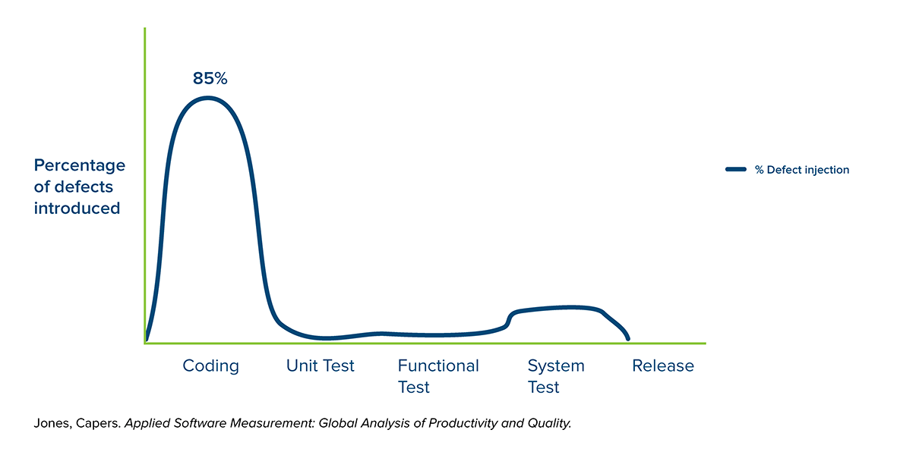

---

<!-- .slide: data-auto-animate data-auto-animate-id="intro" -->
### 🤔 ทำไมต้องเขียนเทส ?

When are those bugs found?

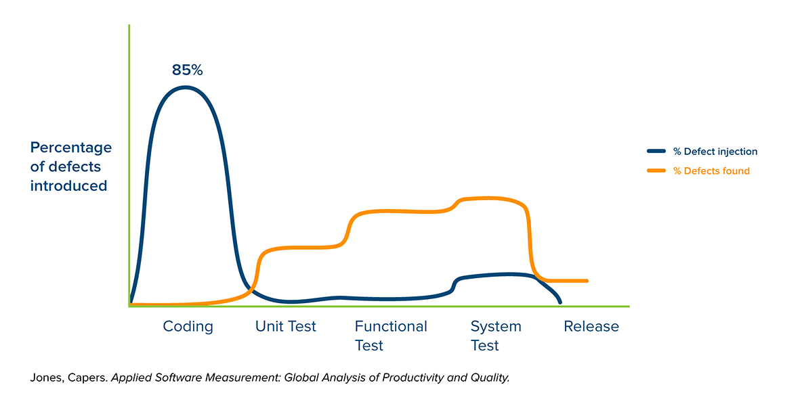

---

<!-- .slide: data-auto-animate data-auto-animate-id="intro" -->
### 🤔 ทำไมต้องเขียนเทส ?

What does it cost to fix bugs?

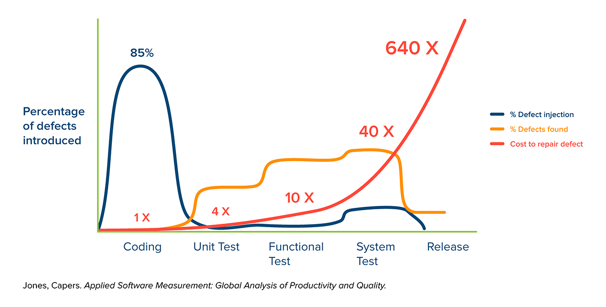

---

<!-- .slide: data-auto-animate data-auto-animate-id="intro" -->
### 🤔 ทำไมต้องเขียนเทส ?

Test early, test often (the shift left approach)

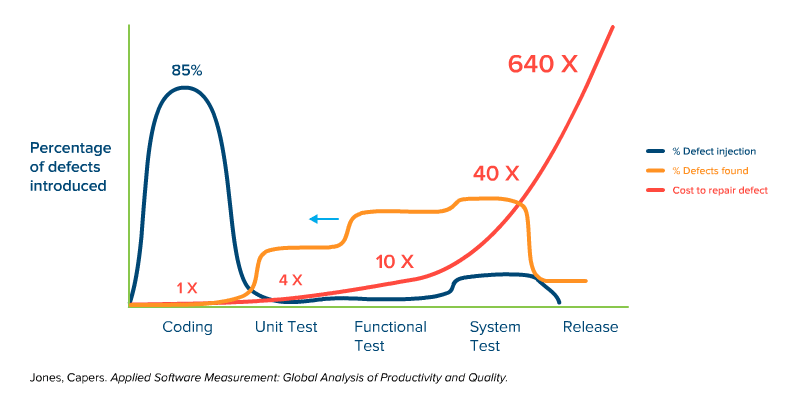

---

<!-- .slide: data-auto-animate data-auto-animate-id="intro" -->
### 🤔 ทำไมต้องเขียนเทส ?

Test early, test often (the shift left approach)

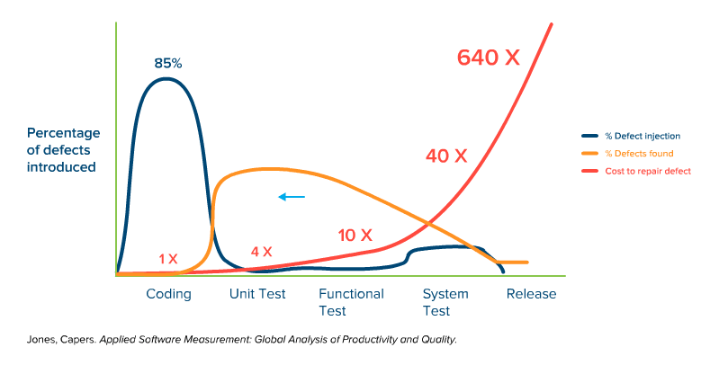

---

<!-- .slide: data-auto-animate data-auto-animate-id="intro" -->
### 🤔 ทำไมต้องเขียนเทส ?

Test early, test often (the shift left approach)

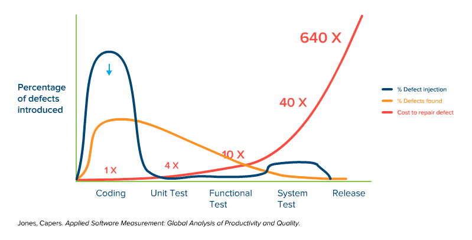

---

<!-- .slide: data-auto-animate data-auto-animate-id="intro" -->
### 🤔 ทำไมต้องเขียนเทส ?

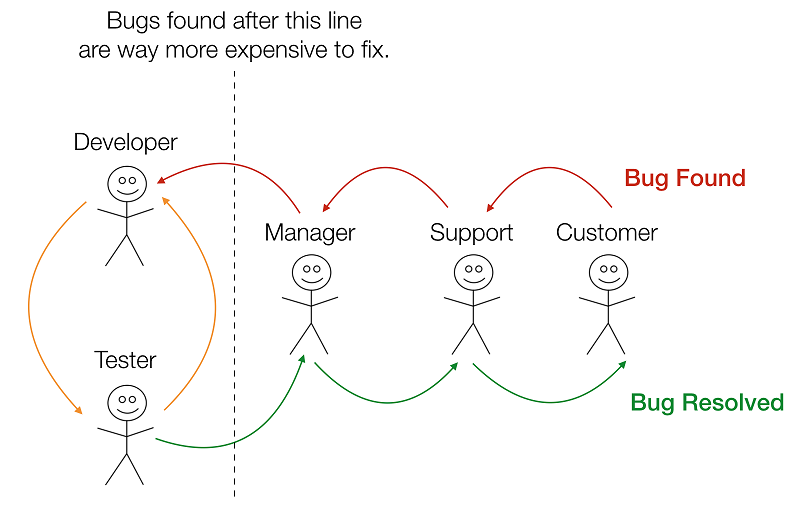

---

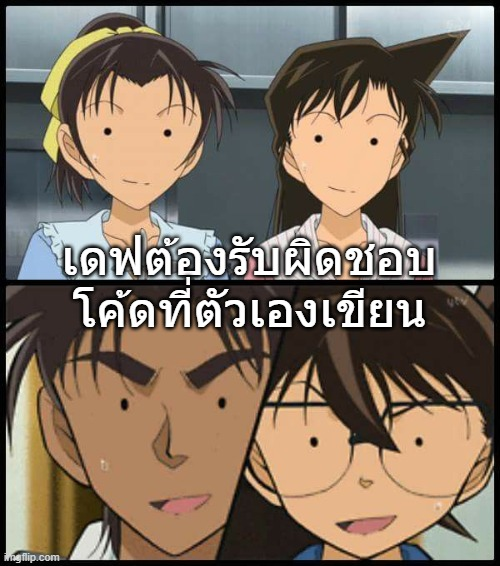

---

<!-- .slide: data-auto-animate data-auto-animate-id="intro" -->
### 🤔 ทำไมต้องเขียนเทส ?

---

<!-- .slide: data-auto-animate data-auto-animate-id="intro" -->
### 😆 เราต้องเขียนเทส

===

## TDD

# Test Driven Development

---

<!-- .slide: data-auto-animate data-auto-animate-id="tdd" -->
### 🤔 ควรเขียนเทสเมื่อไหร่ ?
|รูปแบบการเทส <!-- .element: style="color:orange" -->|ระยะสั้น <!-- .element: style="color:orange" -->|ระยะยาว <!-- .element: style="color:orange" -->|
|--|--|--|
|**(TFD)** Test-First Development|
🐌
|
🚀🚀
|
|**(TLD)** Test-Last Development|
🚀
|
🐌🐌
|

---

<!-- .slide: data-auto-animate data-auto-animate-id="tdd" -->
### 🤔 ควรใช้รูปแบบไหน ?

> 🤕 Cost สูงสุดอยู่ตรงไหน ?  
> 🤕 ออกแบบตั้งแต่แรก หรือ ไปแก้ให้รองรับภายหลัง อันไหนง่ายกว่า ?
<!-- .element: class="small animate__jackInTheBox" style="width:90%" -->

---

<!-- .slide: data-auto-animate data-auto-animate-id="tdd" -->
### 😅 การเทสมีกี่แบบ ?

`Penetration Testing` `Boundary Testing` `End-to-End Testing` `A/B Testing`
`Performance Testing` `System Testing` `Regression Testing` 
`Functional Testing` `Non-Functional Testing` `Smoke Testing` `Load Testing`  `Exploratory Testing` `Automation Testing` `Manual Testing` `Stress Testing` `Sanity Testing` `Unit Testing` `Integration Testing` `User Acceptance Testing` `... 🥲` <!-- .element: class="animate__jackInTheBox" -->
<!-- .element: class="small" -->

---

<!-- .slide: data-auto-animate data-auto-animate-id="tdd" -->
### 🥳 ลองจัดกลุ่มดูซิ

|Functional Testing <!-- .element: style="color:orange" -->|Non-Functional Testing <!-- .element: style="color:orange" -->|
|--|--|
|`Unit Testing` <!-- .element: style="color:#8fb730" --> `Integration Testing` <!-- .element: style="color:#8fb730" --> `System Testing` <!-- .element: style="color:#8fb730" --> `User Acceptance Testing` <!-- .element: style="color:#8fb730" --> `End-to-End Testing` `Smoke Testing` `Sanity Testing` `Monkey Testing` `...`| `Security Testing` `Penetration Testing` `Performance Testing` `Stress Testing` `Load Testing` `Exploratory Testing` `Usability Testing` `...`|
<!-- .element: style="font-size:1.55rem" -->

---

<!-- .slide: data-auto-animate data-auto-animate-id="tdd" -->
### 🤔 มันต่างกันตรงไหน ?

แต่ละตัวมีวัตถุประสงค์ต่างกัน ไม่มีอันไหนสำคัญกว่ากัน ขึ้นอยู่กับเรากำลังเน้น focus เรื่องไหน
<!-- .element: style="font-size:1.6rem" -->

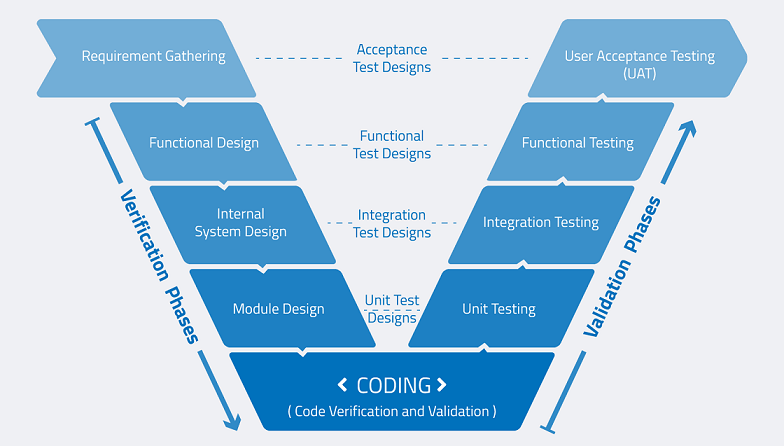

---

<!-- .slide: data-auto-animate data-auto-animate-id="tdd" -->
### 🤔 ควรลงน้ำหนักยังไง ?

[The Practical Test Pyramid](https://martinfowler.com/articles/practical-test-pyramid.html)
<!-- .element: style="font-size:1.6rem" -->

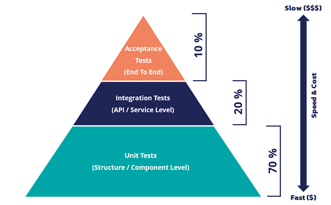

---

<!-- .slide: data-auto-animate data-auto-animate-id="tdd" -->
### 🧪 Testing Frameworks

Unit Testing ━ Integration Testing ━ Acceptance Testing
<!-- .element: style="font-size:2.5rem;color:orange" -->

`xUnit` <!-- .element: style="color:#8fb730" --> `NUnit` `MSTest` `SUnit` `JUnit` `RUnit` `CppUnit` `EUnit` `PerlUnit` `PHPUnit` `...`
<!-- .element: style="font-size:1.55rem" -->

UI Testing
<!-- .element: style="font-size:2.5rem;color:orange" -->

`Playwright` <!-- .element: style="color:#8fb730" --> `Selenium` `Watir` `Visual Studio Coded UI Testing` `Test Studio` `Silk Test` `...`
<!-- .element: style="font-size:1.55rem" -->

---

<!-- .slide: data-auto-animate data-auto-animate-id="tdd" -->
## 😅 พูดเยอะปวดหัว

---

### 🎮 Challenge `01`

**Fizz****Buzz**
<!-- .element: style="font-size:10rem" -->

1 ━ 2 ━ **Fizz** ━ 4 ━ **Buzz**
<!-- .element: style="font-size:2rem" -->

**Fizz** ━ 7 ━ 8 ━ **Fizz** ━ **Buzz**
<!-- .element: style="font-size:2rem" -->

11 ━ **Fizz** ━ 13 ━ 14 ━ **Fizz****Buzz**
<!-- .element: style="font-size:2rem" -->

---

<!-- .slide: data-auto-animate data-auto-animate-id="tdd" -->
# TDD 

> “A **software development process** that relies on the repetition of a **very short development cycle**: **requirements are turned into very specific test cases**, then the software is improved to pass the new tests, only.” ━ Wikipedia
<!-- .element: style="width:100%;font-size:2.1rem" -->

---

<!-- .slide: data-auto-animate data-auto-animate-id="tdd" -->
### หลักการเขียนเทส

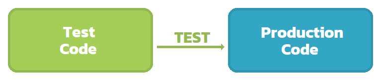

การแก้ไขเทสจะไม่มีผลกระทบกับโค้ดที่ทำงานจริง

---

<!-- .slide: data-auto-animate data-auto-animate-id="tdd" -->
# AAA Pattern 

* Arrange ━ เตรียมตัวก่อนเทส
* Act ━ เรียกใช้ของที่ต้องการเทส
* Assert ━ ตรวจสอบผลลัพท์

> ช่วยแยกขั้นตอนต่างๆไม่ให้ปนกัน + อ่าน/แก้ไข ง่าย
<!-- .element: style="font-size:2rem" -->

---

<!-- .slide: data-auto-animate data-auto-animate-id="tdd" -->
## **Red** → **Green** → **Refactor**
เพิ่มเคสใหม่ ━ เขียนให้พอผ่าน ━ ปรับแก้โค้ดให้ดีขึ้น
<!-- .element: style="font-size:2rem" -->

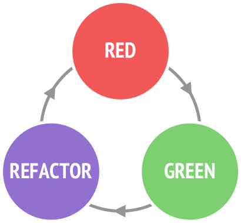
<!-- .element: style="margin-top:0px;margin-bottom:0px" -->

เทสเคสเป็นตัวขับเคลื่อนงาน

---

<!-- .slide: data-auto-animate data-auto-animate-id="tdd" -->
### 💡 Technique

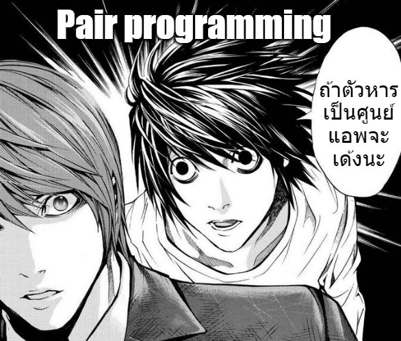
<!-- .element: style="margin-top:0px;margin-bottom:0px" -->

`2Dev 1PC` `เข้าใจโจทย์ตรงกัน` `ลดข้อผิดพลาด` `แบ่งโหลดในอนาคต` `แชร์ความรู้`
<!-- .element: style="margin-top:0px;margin-bottom:0px" -->

---

<!-- .slide: data-auto-animate data-auto-animate-id="tdd" -->
### 😅 พูดเยอะปวดหัว (Part 2)

**Fizz****Buzz**
<!-- .element: style="font-size:10rem" -->

1 ━ 2 ━ **Fizz** ━ 4 ━ **Buzz**
<!-- .element: style="font-size:2rem" -->

**Fizz** ━ 7 ━ 8 ━ **Fizz** ━ **Buzz**
<!-- .element: style="font-size:2rem" -->

11 ━ **Fizz** ━ 13 ━ 14 ━ **Fizz****Buzz**
<!-- .element: style="font-size:2rem" -->

`Pair Programming`

---

<!-- .slide: data-auto-animate data-auto-animate-id="tdd" -->
### การยืนยันความถูกต้อง
# Assertion
<!-- .element: style="color:#f92f60;font-size:11rem" -->

1. ตรวจสอบ `ผลลัพท์` ที่ได้รับกลับมาจากการทำงาน
1. ตรวจสอบ `พฤติกรรม` จากการเรียกใช้ functions  
	* `Object states` - fields, properties
	* `Communication` - method calls between objects

---

<!-- .slide: data-auto-animate data-auto-animate-id="tdd" -->
## 😎 แนวคิดในการเขียนเทส

|ลำดับ|กรอบความคิด|
|--|--|
|**1.Normal cases**|กรณีทั่วไปที่ผู้ใช้ส่วนใหญ่จะได้เจอบ่อยๆ|
|**2.Alternative cases**|กรณีที่นานๆครั้งจะเกิดขึ้น เคสขอบต่างๆ|
|**3.Exceptional cases**|กรณีข้อผิดพลาดที่อาจเกิดขึ้นกับระบบ|
<!-- .element: style="font-size:2rem" -->

> ไม่จำเป็นต้องคิดจนครบทุกกรณี แค่เคสคนทั่วไปจะได้เจอก็พอ แล้วถ้ามีเวลาค่อยกลับมาเพิ่มเคสก็ได้
<!-- .element: style="font-size:2rem" -->

---

<!-- .slide: data-auto-animate data-auto-animate-id="tdd" -->
## ลดปัญหาก่อนเขียนโค้ด

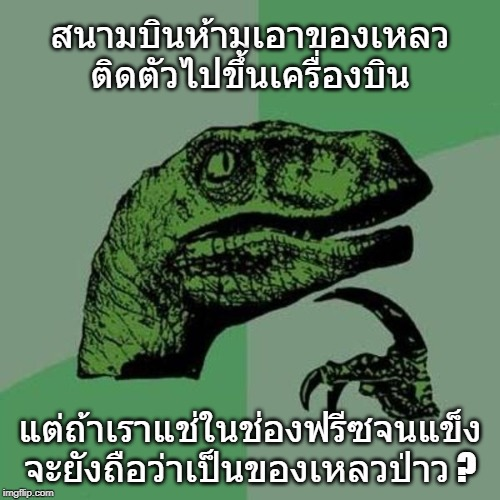 <!-- .element: style="margin-top:0px;margin-bottom:0px" -->

`ตัดก่อนตาย เตือนก่อนวายวอด`
<!-- .element: class="small" -->

---

<!-- .slide: data-auto-animate data-auto-animate-id="tdd" -->
## 🎮 Challenge `02`

# **Login** with **Backoff**
<!-- .element: style="font-size:8rem" -->

|Username|: Admin1, Admin2, Admin3, ... , Admin9 |
|--|--|
|Password|: P@ssw0rd|
<!-- .element: style="font-size:2rem" -->

`1 ~ 3 (none)` `4 ~ 6 (30 sec)` `7 ~ 9 (3 min)` `10+ (30 min)`

---

<!-- .slide: data-auto-animate data-auto-animate-id="tdd" -->
## 🎮 Challenge `03`

# STACK

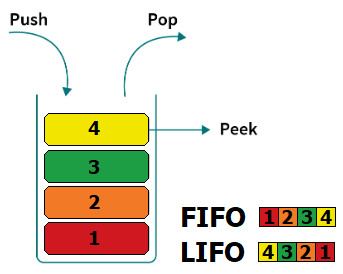

`Push` `Pop` `Peek` ━ `FIFO` `LIFO`

---

<!-- .slide: data-auto-animate data-auto-animate-id="tdd" -->
## 🎮 Challenge `04`
# Tic - Tac - Toe

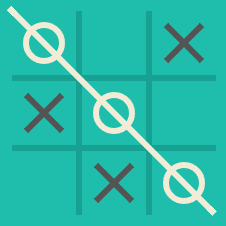

`Console app` ━ `Web app`

===

# 🎉 Summary
<!-- .element: style="color:#8fb730;" -->

1. ปัญหาหลักของบริษัททำซอฟต์แวร์ → การจัดการ
	* `รับงานใหม่` `แก้งานเก่า` `จัดการทีม` `บริหารสภาพคล่อง`
	* Maintenance คือค่าใช้จ่ายหลัก
1. เกิดครึ่งของปัญหาในทีมเดฟเป็นเรื่อง Technical Debt
1. ความสำคัญในการเขียนเทส (Shift left approach)
1. TFD & TLD
1. Functional Testing & Non-Functional Testing
1. Unit testing & Pari Programming
1. Red - Green - Refactor