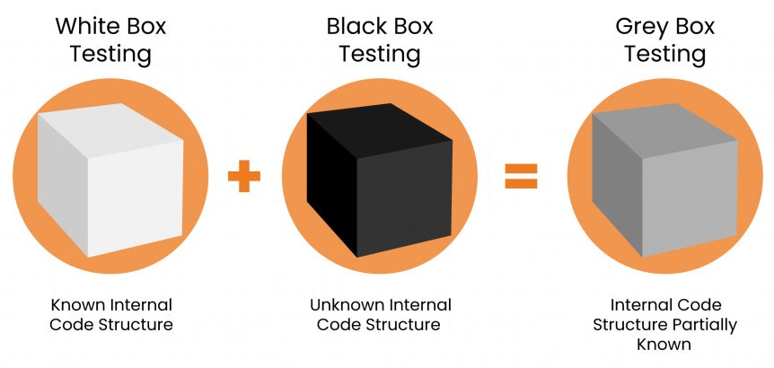
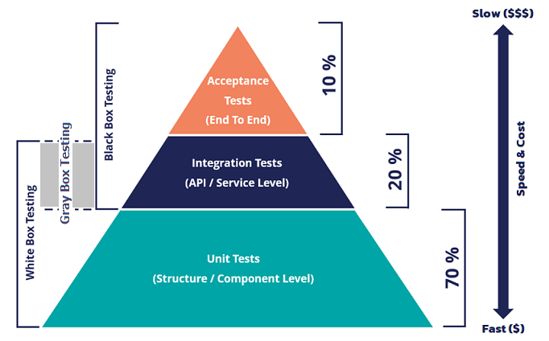

<!-- .slide: data-auto-animate data-auto-animate-id="refactor" -->
# Code <font color="#ad5dc1">Refactoring</font> <!-- .element: style="font-size:10rem" -->

---

## Code Refactoring
> “It is the process of <font color="#8fb730">restructuring existing computer code without changing its external behavior</font>. Refactoring is intended to <font color="orange">improve the design, structure, and/or implementation</font> of the software, while preserving its functionality. Potential advantages of refactoring may include <font color="orange">improved code readability and reduced complexity</font>; these can <font color="orange">improve the source code's maintainability</font> and create a simpler, cleaner, or more expressive internal architecture or object model to improve extensibility.” ━ Wikipedia
<!-- .element: style="width:100%;font-size:2.1rem" -->

`Code design` 💖 `Maintainability`

---

<!-- .slide: data-auto-animate data-auto-animate-id="refactor" data-background="pink" -->
## 💖 Clean Coding <!-- .element: style="color:#f92f60;" -->

> “Any fool can write code that a computer can understand. Good programmers write code that humans can understand.” ━ Martin Fowler
<!-- .element: style="width:100%;font-size:1.9rem" -->

---

## 🎮 Challenge `05`
### 🔥 หยุดก่อนอานนท์ เราร้อนวิชาแล้ว

# โปรแกรมตัดเกรด
<!-- .element: style="color:#f92f60;" -->

|ช่วงคะแนน|85+|70+|60+|50+|อื่นๆ|
|--|--|--|--|--|--|
เกรดที่ได้|A|B|C|D|F|
<!-- .element: style="font-size:2rem" -->

`แก้เกณฑ์การให้คะแนนได้` ━ `เลือกแสดงผลลัพท์ให้ออกทางหน้าจอ หรือ จะพิมพ์ลงกระดาษได้`
<!-- .element: style="color:#747474;font-size:2rem" -->

---

### TDD Cycle

 <!-- .element: style="margin-top:0px;" -->

---

<!-- .slide: data-auto-animate data-auto-animate-id="refactor" data-background="pink" -->
## 💖 Design Principles <!-- .element: style="color:#f92f60;" -->
### Single-Responsibility Principle<!-- .element: style="font-size:4.5rem;color:#3f8dd5;" -->

> ของต่างๆควรมีหน้าที่รับผิดชอบแค่เรื่องเดียว เพื่อความชัดเจนในขอบเขตหน้าที่รับผิดชอบ เพราะเมื่อมี **Requirement change** เกิดขึ้น ของที่กระทบจะอยู่ในวงจำกัด ไม่ลามไปหาตัวอื่นที่ไม่เกี่ยวข้อง
<!-- .element: style="font-size:1.5rem" -->

---

<!-- .slide: data-auto-animate data-auto-animate-id="refactor" data-background="pink" -->
## 💖 Design Principles <!-- .element: style="color:#f92f60;" -->

||❌ห้าม|✅ให้|
|--|--|--|
|1|ยัด Principle หรือ Design ต่างๆเข้ามาตั้งแต่แรก|รอเหตุผลที่ดีพอเข้ามาก่อน ค่อยตัดสินใจนำมาใช้อีกที  (การแก้เชื่อกมันยากกว่าการผูกเชือก)|
|2|เพิ่ม Coupling ในระบบ|เพิ่ม Cohesion โดยต้องไม่เพิ่มความซับซ้อน|
<!-- .element: style="width:100%;font-size:1.7rem" -->

---

## xUnit Attributes

* `Fact` - เทสเคสหลักของสิ่งที่ต้องการจะเทส ข้อมูลที่ใช้ในการทดสอบตายตัว
* `Theory` - เทสเคสที่ใช้เป็นข้อพิสูจน์เทสเคสหลัก ซึ่งสามารถมีข้อมูลทดสอบได้หลายชุด

---

## 🍿 Demo `D01`
# <font color="#3f8dd5">Refactor</font> <font color="orange">Test Cases</font>

---

<!-- .slide: data-auto-animate data-auto-animate-id="refactor" -->
## xUnit → Theory

1. `InlineData`
1. `MemberData`
1. `ClassData`

---

<!-- .slide: data-auto-animate data-auto-animate-id="refactor" -->
## xUnit → Theory

1. `InlineData` <!-- .element: style="color:orange;" -->

```csharp
[Theory]
[InlineData(3, 5, 8)]
[InlineData(2, 8, 10)]
public void Add_TwoPositiveValues_MustBeWorkingCorrectly(int input1, int input2, int expected)
{
	var sut = new Calculator();
	var result = sut.Add(input1, input2);
	Assert.Equal(expected, result);
}
```
<!-- .element: style="width:90%;font-size:1.5rem" -->

2. `MemberData`
1. `ClassData`

---

<!-- .slide: data-auto-animate data-auto-animate-id="refactor" -->
## xUnit → Theory

1. `InlineData`
1. `MemberData`
<!-- .element: style="color:orange;" -->  

```csharp
[Theory]
[MemberData(nameof(PositiveValueCases))]
public void Add_TwoPositiveValues_MustBeWorkingCorrectly(int input1, int input2, int expected)
{
	var sut = new Calculator();
	var result = sut.Add(input1, input2);
	Assert.Equal(expected, result);
}

public static IEnumerable<object[]> PositiveValueCases => new List<object[]>
{
	new object[] { 3, 5, 8 },
	new object[] { 2, 8, 10 },
};
```
<!-- .element: style="width:90%;font-size:1.5rem" -->

3. `ClassData`

---

<!-- .slide: data-auto-animate data-auto-animate-id="refactor" -->
## xUnit → Theory

1. `InlineData`
1. `MemberData`
1. `ClassData`
<!-- .element: style="color:orange;" -->  

```csharp
[Theory]
[ClassData(typeof(PositiveValueCases))]
public void Add_TwoPositiveValues_MustBeWorkingCorrectly(int input1, int input2, int expected)
{
	var sut = new Calculator();
	var result = sut.Add(input1, input2);
	Assert.Equal(expected, result);
}

public class PositiveValueCases : TheoryData<int, int, int>
{
	public PositiveValueCases()
	{
		Add(3, 5, 8);
		Add(2, 8, 10);
	}
}
```
<!-- .element: style="width:85%;font-size:1.4rem" -->

---

### 🎮 Challenge `06`
<font color="#f92f60">**Palindrome**</font> <font color="#8fb730">**Password**</font>
<!-- .element: style="font-size:6.1rem" -->

|Username <!-- .element: style="color:#747474;" -->|Password <!-- .element: style="color:#747474;" -->|Result <!-- .element: style="color:#747474;" -->|
|--|--|--|
|Saladpuk|123456|❌|
|Hello|olleH|✅|
|Selles|selles|✅|
<!-- .element: style="font-size:2rem" -->

---

## 📄 Test data sources

1. `Developers` ━ การฝังเทสเคสเข้าไปในตัวโค้ดโดยตรง <font color="#f92f60">(เดฟเท่านั้นที่ทำได้)</font>
1. `Non-developers` ━ การเขียนเทสเคสจากภายนอกตัวระบบ แล้วโหลดไฟล์เหล่านั้นกลับเข้าไปในระบบเทสเพื่อทำการทดสอบ <font color="#8fb730">(ใครก็ทำได้)</font>

`Local data source` ━ `Shared data source`

---

<!-- .slide: data-auto-animate data-auto-animate-id="refactor" -->
## Testing methods

 <!-- .element: style="margin-top:0px;margin-bottom:0px" -->

|รูปแบบ <!-- .element: style="color:orange;" -->|เป้าหมายในการตรวจสอบ <!-- .element: style="color:orange;" -->|
|--|--|
|White Box|Output & Object's states|
|Black Box|Output & Behaviour|
|Gray Box| White Box & Black Box|
<!-- .element: style="font-size:1.4rem" -->

---

<!-- .slide: data-auto-animate data-auto-animate-id="refactor" -->
## Testing methods



---

## 🍿 Demo `D02`
### <font color="#747474">Black Box Testing</font>
# Serilog <font size="6red">.net</font>
<!-- .element: style="color:#f92f60;font-size:8rem" -->

---

## 💡 Unit Testing Tips

1. การย่อยเทสใหญ่ๆให้กลายเป็นเทสเล็กๆ
1. หมดความสำคัญก็เตะออก [(Guard Clauses)](https://github.com/ardalis/guardclauses)
1. การพิมพ์ผลลัพท์ในเทสด้วย [(ITestOutputHelper)](https://xunit.net/docs/capturing-output)
1. เขียนเทสเพื่อตรวจสอบผลลัพท์และพฤติกรรม อย่าตรวจสอบรายละเอียดลึกๆ เพื่อลด (Brittle code)
1. Code coverage - การมีเทสครอบคลุมไม่ได้หมายถึงมันจะไม่มี bug (มันอาจจะซ่อนอยู่แต่เราไม่รู้ตัวก็ได้)

---

### 🎮 Challenge `07`
<font color="#f92f60">**Password**</font> <font color="#8fb730">**Validation**</font>
<!-- .element: style="font-size:8rem" -->

`ขั้นต่ำ 8 ตัวอักษร` `สูงสุด 256 ตัวอักษร` `ต้องมีตัวเลขอย่างน้อย 1 ตัว` `ต้องมีอักขระพิเศษอย่างน้อย 1 ตัว` `ห้ามมีช่องว่าง` `ต้องมีตัวพิมพ์เล็กอย่างน้อย 1 ตัว` `ต้องมีตัวพิมพ์ใหญ่อย่างน้อย 1 ตัว` `ห้ามใช้ Regular expression เนื่องจากปัญหาด้าน performance`
<!-- .element: style="font-size:2rem" -->

---

<!-- .slide: data-auto-animate data-auto-animate-id="fluent" -->
# <font color="#3f8dd5">Fluent</font> <font color="#f92f60">Assertions</font>

> “Nothing is more annoying than a unit test that fails without clearly explaining why. More than often, you need to set a breakpoint and start up the debugger to be able to figure out what went wrong.” ━ [Fluentassertions](https://fluentassertions.com/introduction)
<!-- .element: style="width:100%;font-size:2rem" -->

---

<!-- .slide: data-auto-animate data-auto-animate-id="fluent" -->
## 🍿 Demo `D03`
# <font color="#3f8dd5">Fluent</font> <font color="#f92f60">Assertions</font>

---

<!-- .slide: data-auto-animate data-auto-animate-id="fluent" -->
# <font color="#3f8dd5">Fluent</font> <font color="#f92f60">Assertions</font>

```csharp
[Theory(DisplayName = "นำตัวเลขที่บวกสองตัวไปรวมกัน ผลลัพท์ต้องเป็นบวก")]
[InlineData(3, 5, 8)]
[InlineData(2, 8, 10)]
public void Add_TwoPositiveValues_TheResultMustBePositive(int input1, int input2, int expected)
{
	var calculator = new Calculator();
	calculator.Add(input1, input2).Should().Be(expected);
}
```
<!-- .element: style="width:100%;font-size:1.7rem" -->

```plaintext
❌ นำตัวเลขที่บวกสองตัวไปรวมกัน ผลลัพท์ต้องเป็นบวก(input1: 3, input2: 5, expected: 8)
Message: Expected result to be positive, but found -2.
```
<!-- .element: style="width:100%;font-size:1.5rem" -->

```plaintext
❌ นำตัวเลขที่บวกสองตัวไปรวมกัน ผลลัพท์ต้องเป็นบวก(input1: 2, input2: 8, expected: 10)
Message: Expected result to be positive, but found -6.
```
<!-- .element: style="width:100%;font-size:1.5rem" -->

---

# Best Practices
<!-- .element: style="color:#3f8dd5;" -->

1. ไม่ต้องเสียงเวลาเขียนเทสให้กับทุกอย่างๆ แต่ให้ทุ่มเวลาเขียนเทสกับ `Core business value` ก่อน ส่วนลำดับถัดมาค่อยเขียนเทสให้กับ `ของที่คลุมเครือ`, `ของที่ส่งผลกระทบสูง` ถึงจะคุ้มกับเวลาที่ลงทุนไป
1. จงดูแลเทสเหมือน `Production code`
1. ของที่เขียนในเทสต้องไม่หลุดไปที่ Production code `Isolation project`
1. ลำดับของเทสไม่ควรมีผลต่อกัน เทสไม่ควรขึ้นต่อกัน `Random failed`
1. เทสควรจะ `ทำงานซ้ำได้เรื่อยๆ` และ `ต้องทำงานได้เร็ว`
1. หลีกเลี้ยงการใช้ static เพื่อป้องกัน `Global state`
1. เทสควรจะมองในมุมของ What ไม่ใช่ How ไม่อย่างนั้นจะทำให้เกิด `Brittle code`

<!-- .element: style="font-size:2rem" -->

===

<!-- .slide: data-auto-animate data-auto-animate-id="challenge" -->
### 🎮 Challenge `08`

<font color="#8fb730">**Largest**</font> <font color="#ad5dc1">**Prime**</font> <font color="#f92f60">**Factor**</font>
<!-- .element: style="font-size:6.1rem" -->

|ตัวเลข|ตัวประกอบ|
|--|--|
|15|`3` x `5` <!-- .element: style="color:#f92f60;" -->|
|13,195|`5` x `7` x `13` x `29` <!-- .element: style="color:#f92f60;" -->|
|600,851,475,143|🤔 `6,857` <!-- .element: class="fragment" style="color:#f92f60;" -->|
<!-- .element: style="font-size:2rem" -->

`ต้องหาผลลัพท์ได้ภายใน 1 วินาที`

---

<!-- .slide: data-auto-animate data-auto-animate-id="challenge" -->
### 🎮 Challenge `09`

<font color="#8fb730">**10001st**</font> <font color="#ad5dc1">**Prime**</font>
<!-- .element: style="font-size:6.1rem" -->

ตัวเลขจำนวนเฉพาะ 20 ตัวแรกได้แก่
<!-- .element: style="font-size:2rem" -->

`2` `3` `5` `7` `11` `13` <!-- .element: style="color:#8fb730;" --> `17` `19` `23` `29` `31` `37` `41` `43` `47` `53` `59` `61` `67` <!-- .element: style="color:#ad5dc1;" --> `71`

<!-- .element: style="font-size:2rem" -->

|ลำดับที่|เลขจำนวนเฉพาะคือ|
|--|--|
|6|<font color="#8fb730">13</font>|
|19|<font color="#ad5dc1">67</font>|
|10001|🤔 `104,743` <!-- .element: class="fragment" style="color:#f92f60;" -->|
<!-- .element: style="font-size:2rem" -->

`ต้องหาผลลัพท์ได้ภายใน 1 วินาที`

---

<!-- .slide: data-auto-animate data-auto-animate-id="challenge" -->
### 🎮 Challenge `10`
<font color="#f92f60">**Number**</font> To <font color="#8fb730">**Text**</font>
<!-- .element: style="font-size:6.1rem" -->

|Input|Expected|
|--|--|
|1|หนึ่ง|
|53|ห้าสิบสาม|
|571|ห้าร้อยเจ็ดสิบเอ็ด|
|3,234|สามพันสองร้อยสามสิบสี่|
|620,000|หกแสนสองหมื่น|
|1,234,567|หนึ่งล้านสองแสนสามหมื่นสี่พันห้าร้อยหกสิบเจ็ด|
|58,000,341|ห้าสิบแปดล้านสามร้อยสี่สิบเอ็ด|
<!-- .element: style="font-size:1.2rem" -->

===

# 🎉 <font color="#8fb730">Summary</font>

1. Refactoring process
1. Design Principles & Pitfall
1. Fact & Theory
1. Testing methods `WhiteBox` `BlackBox` `GrayBox`
1. Tips `ย่อยเทส` `Guard clause` `Custom test output`
1. Fluent Assertions
1. Best practices