<!-- .slide: data-auto-animate data-auto-animate-id="isolate" -->
# <font color="#8fb730">Isolated</font>
<!-- .element: style="font-size:10rem" -->

# <font color="#f92f60">Test Environments</font>
<!-- .element: style="font-size:7rem" -->

---

<!-- .slide: data-auto-animate data-auto-animate-id="isolate" -->
### Unit Testing & Integration Testing

[The Practical Test Pyramid](https://martinfowler.com/articles/practical-test-pyramid.html)
<!-- .element: style="font-size:1.6rem" -->


---

<!-- .slide: data-auto-animate data-auto-animate-id="isolate" -->
## Unit Testing

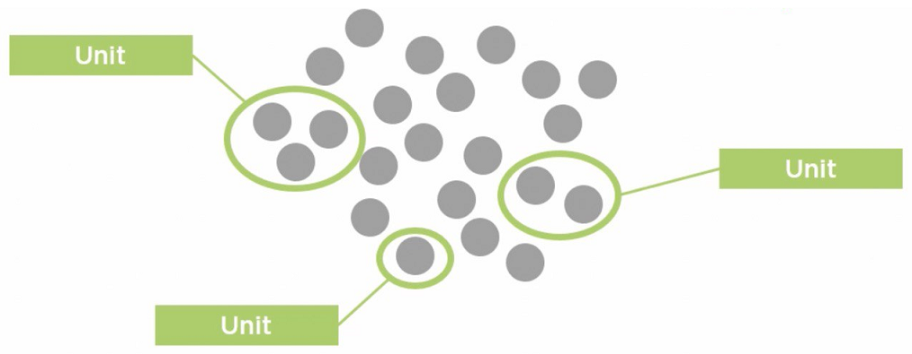

🎯 ทดสอบของต่างๆให้มีพฤติกรรมตามที่เดฟคาดหวัง
<!-- .element: style="font-size:2rem" -->

---

<!-- .slide: data-auto-animate data-auto-animate-id="isolate" -->
## Isolate for testing

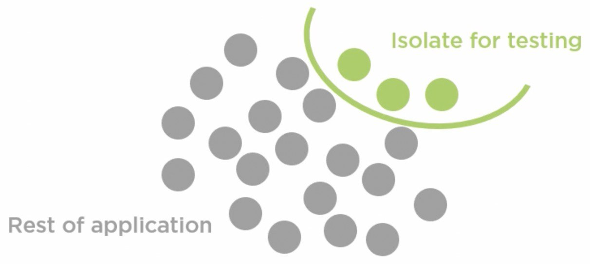

💡 แยกของที่จะเทสออกมา เพื่อป้องเทสหลุดเข้า production source
<!-- .element: style="font-size:2rem" -->

---

<!-- .slide: data-auto-animate data-auto-animate-id="isolate" -->
## Isolate for testing


บางสถานะการณ์ของที่จะเทสไปพันกับเรื่องอื่นโดยเลี่ยงไม่ได้ เช่น ต่อ database, เรียกใช้งาน module อื่น ซึ่งส่งผลให้<font color="#f92f60">คุมผลลัพท์ไม่ได้</font>
<!-- .element: style="font-size:2rem" -->

---

## ✌️ <font color="orange">Test Double</font>

> “It is a generic term for any case where you replace a production object for testing purposes.” ━ [Martin Fowler](https://martinfowler.com/bliki/TestDouble.html)
<!-- .element: style="width:100%;font-size:2.1rem" -->

1. `Dummy` objects are passed around but never actually used. Usually they are just used to fill parameter lists.
1. `Fake` objects actually have working implementations, but usually take some shortcut which makes them not suitable for production (an [InMemoryTestDatabase](https://martinfowler.com/bliki/InMemoryTestDatabase.html) is a good example). 
1. `Stubs` provide canned answers to calls made during the test, usually not responding at all to anything outside what's programmed in for the test.
1. `Spies` are stubs that also record some information based on how they were called. One form of this might be an email service that records how many messages it was sent.
1. `Mocks` are pre-programmed with expectations which form a specification of the calls they are expected to receive. They can throw an exception if they receive a call they don't expect and are checked during verification to ensure they got all the calls they were expecting.

<!-- .element: style="width:100%;font-size:1.5rem" -->

---

# <font color="#3f8dd5">Mock</font> <font color="orange">Object</font>
<!-- .element: style="font-size:8rem" -->

> “mock objects are <font color="#8fb730">simulated objects that mimic the behavior of real objects in controlled ways</font>, most often as part of a software testing initiative. A programmer typically creates a mock object to <font color="orange">test the behavior of some other object</font>, in much the same way that a car designer uses a crash test dummy to simulate the dynamic behavior of a human in vehicle impacts.” ━ Wikipedia
<!-- .element: style="width:100%;font-size:2.1rem" -->

Object ที่เดฟสามารถควบคุมพฤติกรรมได้ เอาไว้ใช้ในการทดสอบ
<!-- .element: style="font-size:2rem" -->

---

<!-- .slide: data-auto-animate data-auto-animate-id="isolate" -->
## Isolate for testing

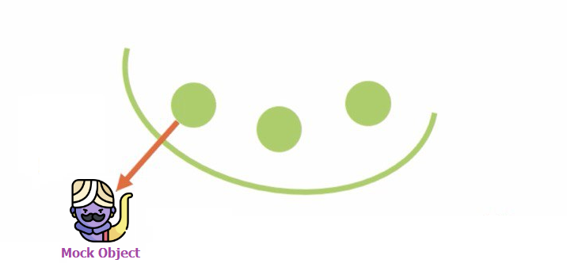

ใช้ Mock object กับสิ่งที่เป็น dependency กับของที่เราต้องการทดสอบ <font color="#f92f60">เพื่อใช้ในการควบคุมพฤติกรรม และ การตรวจสอบการทำงานต่างๆ</font>
<!-- .element: style="font-size:2rem" -->

---

## 🍿 Demo `D04`
# <font color="#3f8dd5">Mock</font> <font color="orange">Object</font>
<!-- .element: style="font-size:8rem" -->

> [https://github.com/moq/moq4](https://github.com/moq/moq4)

---

## Mo<font color="orange">q</font>

Setup & Verify

```csharp
// ตั้งค่าการทำงานของ Mock object
var mock = new Mock<ICalculator>();
mock.Setup(it => it.Add(3, 4)).Returns(7);

// เรียกใช้ Mock object
ICalculator calculator = mock.Object;
var result = calculator.Add(3, 4);

// ตรวจสอบความถูกต้อง
Assert.Equal(7, result);
mock.Verify(it => it.Add(3, 4), Times.AtMostOnce());
```
<!-- .element: style="width:75%;font-size:2.3rem" -->

---

## Mo<font color="orange">q</font>

`Loose` / `Strict` behaviours

```csharp
// Loose behaviour (default)
var looseMock = new Mock<ICalculator>(MockBehavior.Loose);
ICalculator calculator = looseMock.Object;
var result = calculator.Add(3, 4); // result: 0
```
<!-- .element: style="width:90%;font-size:2.3rem" -->

```csharp
// Strict behaviour
var strictMock = new Mock<ICalculator>(MockBehavior.Strict);
ICalculator calculator = strictMock.Object;
var result = calculator.Add(3, 4); // Throw MockException
```
<!-- .element: style="width:90%;font-size:2.3rem" -->

---

### 🎮 Challenge `11`
# <font color="#3f8dd5">Authentication</font> <font color="orange">Service</font>
<!-- .element: style="font-size:5rem" -->

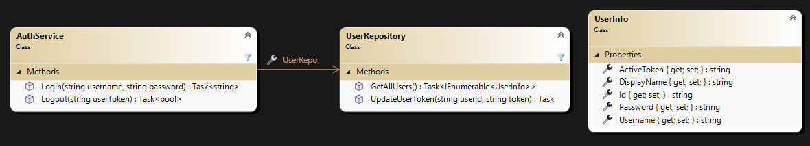

---

### ประโยชน์จากการใช้
# <font color="#3f8dd5">Mock</font> <font color="orange">Object</font>
<!-- .element: style="font-size:7rem" -->

1. ควบคุมสภาพแวดล้อม และ พฤติกรรมทุกอย่างได้
1. เร็วกว่าการทำงานจริง เช่น ต่อ database
1. ทำซ้ำได้เรื่อยๆไม่มีข้อจำกัด เช่น ค่าใช้จ่าย

---

<!-- .slide: data-auto-animate data-auto-animate-id="isolate" -->
### 🤔 จะแยกไม่ให้ปนกันยังไง ?

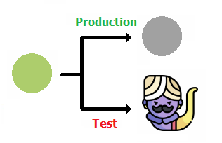

|Environment <!-- .element: style="color:orange;" -->|Expected  <!-- .element: style="color:orange;" -->|
|--|--|
|Production|ทำงานกับโค้ดที่เขียนไว้จริงๆ|
|Test|ทำงานกับ Mock object|

---

## 🧪 <font color="#8fb730">Testable Code</font>
### <font color="orange">ไม่ได้เกิดขึ้นเอง</font> มันต้องเกิดจาก
### <font color="#f92f60">ความตั้งใจ - ตั้งแต่กระบวนการออกแบบ</font>

---

<!-- .slide: data-auto-animate data-auto-animate-id="isolate" data-background="pink" -->
## 💖 Design Principles <!-- .element: style="color:#f92f60;" -->
### Dependency Inversion Principle <!-- .element: style="color:#3f8dd5;" -->

> 1. High-level modules SHOULD NOT depend on low-level modules. **Both should depend on abstractions.**
> 1. Abstractions SHOULD NOT depend on details. **Details should depend on abstractions.**

<!-- .element: style="width:100%;font-size:1.3rem" -->

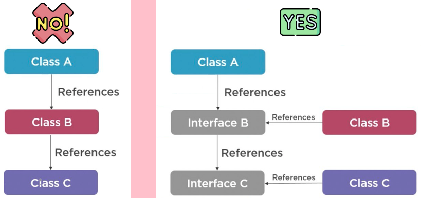

---

<!-- .slide: data-auto-animate data-auto-animate-id="isolate" data-background="pink" -->
## 💖 Design Principles <!-- .element: style="color:#f92f60;" -->
### Dependency Inversion Principle <!-- .element: style="color:#3f8dd5;" -->

> หัวใจหลักของ OOP คือการมองของต่างๆเป็น `Components` เพื่อแบ่งหน้าที่ในการรับผิดชอบออกจากกัน แล้วให้ควบคุม `Communications` ที่เกิดขึ้นจากการทำงานร่วมกันของ Components เหล่านั้น
<!-- .element: style="width:100%;font-size:1.5rem" -->


`ถอดเปลี่ยนชิ้นได้`

---

### 🎮 Challenge `11` (Part 2)
## <font color="#ad5dc1">Refactoring</font>
<!-- .element: style="font-size:6rem" -->

### Dependency Inversion Principle

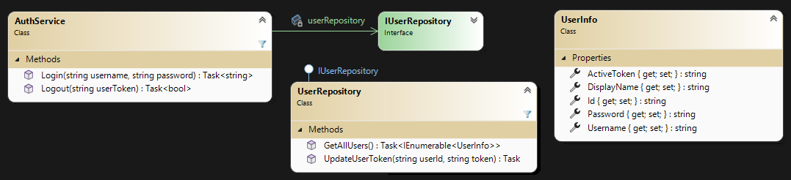

---

<!-- .slide: data-auto-animate data-auto-animate-id="isolate" data-background="pink" -->
## 🧩 Design Pattern <!-- .element: style="color:#f92f60;" -->
### Dependency Injection <!-- .element: style="color:#3f8dd5;" -->

> “It is a design pattern in which an object receives other objects that it depends on. Dependency injection aims to <font color="#2d9719">**separate the concerns of constructing objects**</font> and using them, <font color="#cb640b">**leading to loosely coupled programs**</font>.” ━ Wikipedia
<!-- .element: style="width:100%;font-size:1.7rem" -->


ใช้ DI เพื่อช่วยในการแยก Test กับ Production ออกจากกัน
<!-- .element: style="font-size:2rem" -->

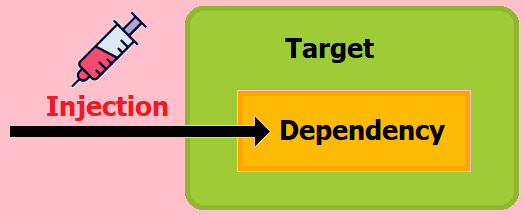

---

<!-- .slide: data-auto-animate data-auto-animate-id="isolate" -->
## 🍿 Demo `D05`
# Dependency Injection
<!-- .element: style="color:#3f8dd5;font-size:5rem" -->

[`(built-in) ASP.NET MVC`](https://learn.microsoft.com/en-us/aspnet/core/fundamentals/dependency-injection) [`(custom) SimpleInjector`](https://simpleinjector.org)

---

<!-- .slide: data-auto-animate data-auto-animate-id="isolate" -->
## 🍿 Demo `D06`
# [AutoFixture](https://github.com/AutoFixture/AutoFixture)
<!-- .element: style="color:#3f8dd5;font-size:8rem" -->

> AutoFixture makes it easier for developers to do Test-Driven Development by automating non-relevant Test Fixture Setup, allowing the Test Developer to focus on the essentials of each test case.
<!-- .element: style="width:100%;font-size:1.7rem" -->

===

# Testing with
<!-- .element: style="font-size:6rem" -->

# Entity Framework
<!-- .element: style="color:#3f8dd5;font-size:7.5rem" -->

---

<!-- .slide: data-auto-animate data-auto-animate-id="isolate" -->
### 🤔 กรณีต่อ DB จะเทสยังไง?


`ProductService` → `SqlProductRepository` → `ShoppingContext` → `DB`
<!-- .element: class="small animate__jackInTheBox" style="color:#ffb02e" -->

---

<!-- .slide: data-auto-animate data-auto-animate-id="isolate" -->
### ☝️ <font color="#3f8dd5">Mock</font> Object

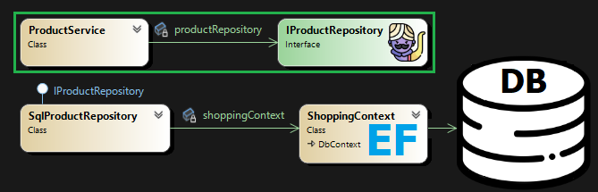

`Unit Testing` → `ProductService` -❌→ `DB`
<!-- .element: class="small animate__jackInTheBox" style="color:#ffb02e" -->

---

<!-- .slide: data-auto-animate data-auto-animate-id="isolate" -->
### ✌️ <font color="#3f8dd5">Mock</font> Object

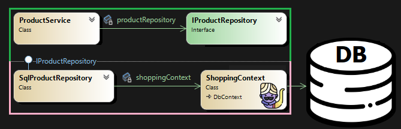

`Unit Testing` → `SqlProductRepository` → `ShoppingContext` -❌→ `DB`
<!-- .element: class="small animate__jackInTheBox" style="color:#ffb02e" -->

`Integration Testing` → `ProductService`→ `SqlProductRepository`→ `ShoppingContext` -❌→ `DB`
<!-- .element: class="small animate__jackInTheBox" style="color:#ffb02e" -->

---

#### Mock = โบกมือลา
## 🪄 Database Magic
<!-- .element: style="color:orange;" -->

`DEFAULT` `CHECK` `NOT NULL` `UNIQUE KEY` `PRIMARY KEY` `FOREIGN KEY` `AUTO INCREMENT` `INDEX` `DBMS stuff` `... 🥲` <!-- .element: class="animate__jackInTheBox" -->

---

<!-- .slide: data-auto-animate data-auto-animate-id="isolate" -->
### 👌 <font color="#747474">Temporary</font> Database

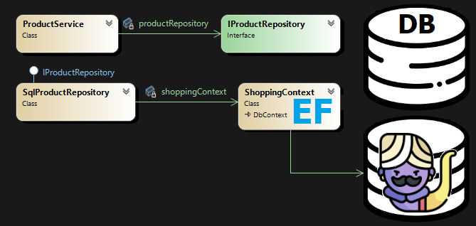

`ProductService` → `SqlProductRepository` → `ShoppingContext` → `DB`
<!-- .element: class="small animate__jackInTheBox" style="color:#ffb02e" -->

😰 `วุ่นวาย` `ช้า` `เทสพร้อมกันไม่ได้` `เคลียของเก่าก่อนเทส`
<!-- .element: class="small animate__jackInTheBox" style="color:#ffb02e" -->

---

### 🤨 Database
# ไม่เคยถูกเทส ?
<!-- .element: class="small animate__jackInTheBox" style="color:#f92f60" -->

---

### 🤔 จะเทส DB ยังไง ?

`ใช้แบบจำลอง` → `ไม่ได้ความสามารถแบบของจริง`
<!-- .element: class="animate__jackInTheBox" style="color:#ffb02e" -->

`ใช้ของจริง` → `ติดตั้งยาก` `ช้า` `เทสหลายเคสพร้อมกันไม่ได้`
<!-- .element: class="animate__jackInTheBox" style="color:#ffb02e" -->

---

## Lightweight & In-memory <!-- .element: style="color:#f92f60" -->
# Database

`ไม่ต้องติดตั้ง` `เร็ว` `เทสหลายเคสพร้อมกันได้` `มีความสามารถแบบของจริง` `Constraints` `Auto Increment`  `... 😆`
<!-- .element: class="animate__jackInTheBox" style="color:#ffb02e" -->

---

# [🪶 SQLite](https://www.sqlite.org)
### Microsoft.EntityFrameworkCore.Sqlite

`Small` `Fast` `Self-contained` `High-reliability` `Full-featured` `Maintained by Microsoft` [`Nuget`](https://www.nuget.org/packages/Microsoft.EntityFrameworkCore.Sqlite)

[EF Database Providers](https://learn.microsoft.com/en-us/ef/core/providers/?tabs=dotnet-core-cli)


---

<!-- .slide: data-auto-animate data-auto-animate-id="isolate" -->
### 👍 SQLite
<!-- .element: style="color:#3f8dd5;" -->

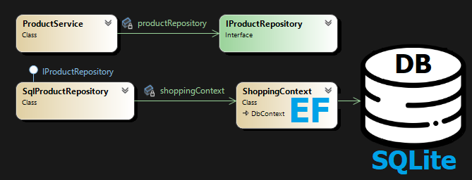

`ProductService` → `SqlProductRepository` → `ShoppingContext` → `DB`
<!-- .element: class="small animate__jackInTheBox" style="color:#ffb02e" -->

---

<!-- .slide: data-auto-animate data-auto-animate-id="isolate" -->
## 🍿 Demo `D07`
# SQLite
<!-- .element: style="color:#3f8dd5;font-size:12rem" -->

===

## 💡หลักการออกแบบ

`Programming to an Interface`

* Avoid using concrete type and new keyword
* Dependency Injection (IoC)
* Reducing Coupling
* Factory Pattern, Builder Pattern

===

# 🎉 Summary
<!-- .element: style="color:#8fb730;" -->

1. Isolated Test Environments
1. Test Double → `Mock Object` → `Moq`
1. Testable Code → `เกิดจากความตั้งใจ`
1. Design Principle → `Dependency Inversion`
1. Design Pattern → `Dependency Injection`
1. Tools
	* AutoFixture
	* SQLite